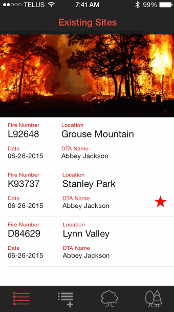

# Danger Tree Assessment
###Saving BC's Wildfire Firefighters and First Responders 
Abbey Jackson (@earthabbey) & Alain Kahwaji (@codinglegend)

 

###The Problem:
When there's a wildfire, firefighters work hard to contain the fire. Nonetheless, there are still hazards that exist all around the perimeter of the fire. The danger assessors assess these hazard, and determine which trees are dangerous and pose a threat to on-site workers. However, this assessment process is currently being done by paper where hundreds of paper reports must be processed each day. This process can take days on a larger fire -- putting all on-site workers at risk. Our app digitizes the data collection and sharing process and speeds it up significantly by 1) collecting data easily and intuitively and 2) exporting that data in a spreadsheet instead of shuffling through hundreds of papers. 

###The Innovation:
We are developing a mobile app which will significantly accelerate the process of mapping dangerous areas by collecting and delivering the data digitally. In addition, Danger Tree Assessors currently focus on areas as a whole as opposed to marking individual trees -- leaving a significant margin of error. By utilizing the GPS technology on a mobile device, we will be able to accurately capture information for each tree within an area. This information will be transferred in a spreadsheet to the data centre at the end of the day (or earlier if wifi/data is available). The Geographic Information Specialists will easily convert our data into a map, reduce human error and accelerate the process in order to ensure a safe working environment. We will create a map that will be shared via AirDrop in-field, revolutionizing the current process by allowing for updates of  hazards and danger zones in real-time.

###The Details and Attributions:
Using REALM as a backend the Danger Tree Assessment app allows for on-site digital capture of everything that is currently being captured on paper, sticking to the step by step process currently in use. Additionally GPS is captured for each individual trees, allowing maps to be more accurate (in the current system GPS is captured only for the overall site location). This data is then exported via a CVS file using CHCVSParser. Icon assets are provided by icons8.com. Assessment information Copyright BCWildfires and is being used only for demonstration purposes.

Logic checks are done to ensure trees are added to the correct site, new trees are not added without an associated site, and new sites are not created by accident when a site is already open. A user can leave their site reports open to submit later or can submit whilst in field and the email will be sent when their device finds a wifi or data connection.

##Using the App

###The order of bottom tab bar buttons is:

Site List — Add New Site — Add Tree / View Current Tree — Site Report

###Step by step:

1. When you open the app for the first time it will open on a blank page. This is where the list of sites you create will be displayed.
2. Tap the Add New Site button to start a new site. Commencement GPS will be captured but not displayed. Fill in the site details as appropriate and then tap Save Site and Add Tree.
3. Fill in the tree information and follow the prompts. Tree Management is the last step in the tree assessment process and the button “Make Tree Report” will display a tree report. If there is an error you can use the back button to fix it. If you go back you will see the data is there, however when you go forward again the next screens you will have to enter the data again. So be aware of that… if you made a mistake and have to go back to the first screen in the assessment process you will have to basically do the whole assessment again. If you go back only one screen then the previous data is still there but you’ll have to redo one screen’s worth of assessment data. This is hard to explain but you’ll see what I mean when you use the app.
4. When the Tree Report is correct tap Save Tree. This will, as the name implies, save the tree (up until now you have a tree “open” but not saved). If you close the app without saving the tree you may lose the assessment information FYI. After saving the tree you will be asked if you want to add another tree or Submit the report.
5. If you tap Submit Report you will now see the Site Report. You can submit it by tapping Submit or you can tap the Add Tree button in the tab bar to keep adding trees or you can tap the Add Site button to leave the site open and create a new site. When you submit a report successfully the site now becomes “closed” (this means creating and “sending” an email — if no connection your email app will hold onto it and actually send it when you have a connection but as far as our app is concerned it’s sent).
 

###Open & Closed Sites:

* On the data list (the first tab bar button) sites that are still open have a red star
* You can only add trees to an open site. Once the site report is submitted the site is now closed
* Additionally you can only add trees to the most recent site and only if the most recent site was made on the same day. This way assessors can stop a site assessment, go have lunch, come back and keep working on the same site. If they want to work on a new site they simply create a new site but then that previous one can not be added to. We did it this way because otherwise there will be human error in people adding trees to the wrong site.
* GPS is captured when the site is first created so make sure you Add Site only when you’re actually at the site.
* Termination GPS is captured when the site is closed. That means when the site report is submitted. It should be obvious by comparing those coordinates with the coordinates of the last tree if the site was closed at the right location or later somewhere else. The data centre will have to use the last tree’s coordinates for termination if the assessor closes the site somewhere else.
 

###Database Management:

* If you want to clear the list of sites (the database), delete the app and reinstall
* Ensure all site reports are submitted before installing new versions of the app incase the data is lost. It shouldn’t be but we are still testing so I can’t gaurantee it.
