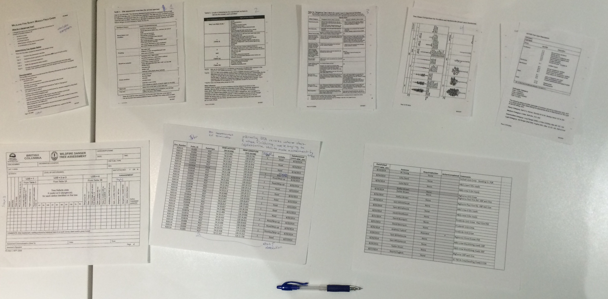
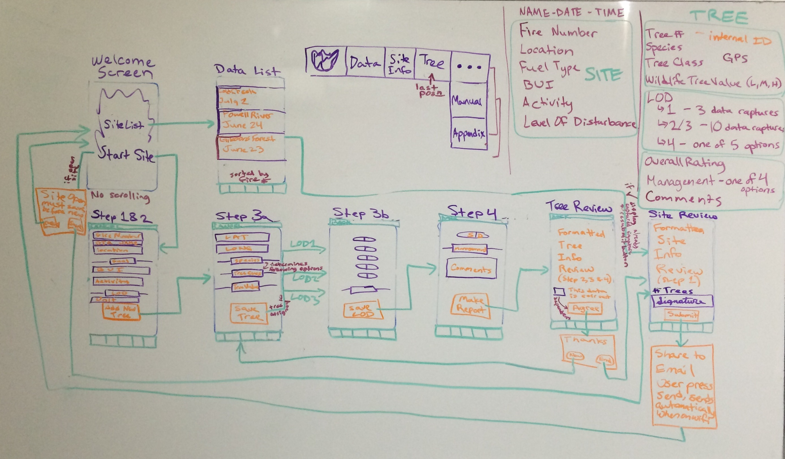

# Danger Tree Assessment
Saving BC's Wildfire Firefighters and First Responders 
Abbey Jackson & Alain Kahwaji

#####* In Progress: Development began June 15, 2015 *

###Problem:
Currently BC Wildfires uses an antiquated paper system for dangerous tree data collection. Hundreds of papers are submitted containing GPS coordinates and maps are drawn accordingly, indicating safe areas and dangerous areas. However, because this process is being done manually on paper, substantial delays in mapmaking exist which can be as long as several days on large fires. With delays like these, First Responders on the scene are subjected to additional dangers -- in an already very dangerous work environment -- due to the slow processing time of the information. We intend to solve this problem by digitizing the process efficiently and intuitively. We will create a mobile app which gathers not only more accurate information, but organizes that information such that it can be drawn on a map in a significantly shorter time frame. First responders will finally have an up-to-date map and complete information of danger areas. 

###The Innovation:
We are developing a mobile app which will significantly accelerate the process of mapping dangerous areas by collecting and delivering the data digitally. In addition, Danger Tree Assessors currently focus on areas as a whole as opposed to marking individual trees -- leaving a significant margin of error. By utilizing the GPS technology on a mobile device, we will be able to accurately capture information for each tree within an area. This information will be transferred in a spreadsheet to the data centre at the end of the day (or earlier if wifi/data is available). The Geographic Information Specialists will easily convert our data into a map, reduce human error and accelerate the process in order to ensure a safe working environment. We will create a map that will be shared via AirDrop in-field, revolutionizing the current process by allowing for updates of  hazards and danger zones in real-time.

from this ^^^^^ to this:

